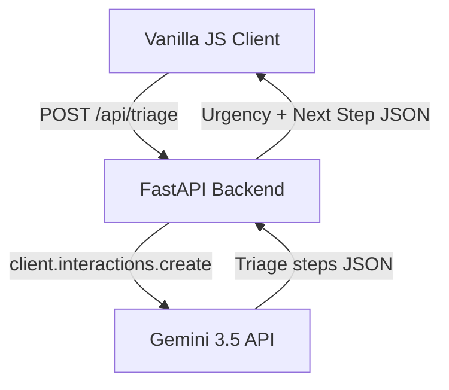

# PawPurse — Engineering Design Doc

**Author:** Antigravity  
**Status:** Draft v0.1  
**Last updated:** 2026-06-28  
**Reviewers:** TBD  

---

## 1. Summary

We are building a lightweight, mobile-first web application for emergency pet triage. The system consists of a fast, single-page Vanilla JS/CSS frontend and a Python FastAPI backend API. The core engine integrates the Gemini 3.5 Interactions API (`gemini-3.5-flash`) via the `google-genai` SDK to classify free-text symptoms into one of three urgency levels (RED, YELLOW, GREEN) and return a direct, non-diagnostic next-step action. By using a backend proxy, we secure our API credentials while maintaining p95 latencies under 2 seconds.

## 2. Assumptions

- **Target scale:** <10k DAU in v1.
- **Latency budget:** p95 < 2s for the core triage classification request.
- **Platform:** Mobile-first web application (compatible with iOS Safari and Android Chrome).
- **Cost ceiling:** Under $0.005 API cost per triage check.
- **Out of scope:** Accounts, profile creation, persistent server-side search logs, maps.

## 3. Goals & non-goals

**Goals (v1):**
- Instantly classify symptom text into RED (extreme), YELLOW (urgent), or GREEN (non-urgent).
- Deliver action-oriented next steps based on the classification without diagnosing specific diseases.
- Secure the Gemini API key in a server-side environment.
- Maintain a p95 latency under 2.0s for the API call (including LLM response time).

**Non-goals (v1):**
- Designing a database schema to persist search history or pet records.
- Integrating maps, clinic locations, or directions.
- Naming specific diseases (e.g., "parvovirus") or recommending medications.
- Supporting high-availability clustering (a single backend container/VM is sufficient for <10k DAU).

## 4. Architecture



**What's here:**
- **Vanilla JS Client:** A single-page static web page that collects symptom descriptions, queries the backend, and displays the full-screen color-coded result state.
- **FastAPI Backend:** A lightweight ASGI service built in Python, managed via `uv` for lightning-fast environment setup and dependency resolution.
- **Gemini Triage Client:** A service layer that interacts with `gemini-3.5-flash` using the modern `client.interactions.create` API.

**What's deliberately NOT here:**
- **No Database:** Triage interactions are ephemeral and state-free; no user data or symptoms are stored on the server.
- **No Map or GPS APIs:** The frontend relies on plain-text instructions for next steps rather than interactive maps.

## 5. Key components

### Frontend Client
- **Responsibility:** Capturing symptom text, displaying loading animation, handling error states, and rendering full-screen visual color updates.
- **Tech choice:** HTML5, Vanilla ES6 Javascript, and CSS3.
- **Why this choice:** Zero build steps, instant load times, and maximum compatibility. Perfect for an emergency triage tool.
- **Interface:** Exposes UI state managers `showInputState()`, `showLoadingState()`, `showResultState(data)`, and `showErrorState(message)`.

### FastAPI Application
- **Responsibility:** Routing requests, performing schema validation, enforcing rate limits, and communicating with the Triage Engine.
- **Tech choice:** FastAPI with `uvicorn`.
- **Why this choice:** Extremely low latency overhead, native async support, and auto-generated OpenAPI docs. Runs out-of-the-box with `uv`.
- **Interface:** Exposes `POST /api/triage`.

### Gemini Triage Engine
- **Responsibility:** Constructing prompts, calling the Gemini API, and parsing structured JSON triage outputs.
- **Tech choice:** `google-genai` SDK (version >= 2.0.0) calling `gemini-3.5-flash`.
- **Why this choice:** Standardizes model access via the modern Interactions API. We leverage `thinking_level: "minimal"` to minimize latency.
- **Interface:** Exposes python function `classify_symptoms(symptoms: str) -> dict`.

## 6. Data model

```typescript
type TriageResult = {
  urgency: "RED" | "YELLOW" | "GREEN";
  action_directive: string;
  key_instructions: string[];
};
```

**Notes:**
- No database tables exist. Data schemas are enforced purely at the API request/response boundary using Pydantic in the FastAPI layer.

## 7. API surface

### `POST /api/triage`

- **Input Schema:**
  ```json
  {
    "symptoms": "My pug is drooling and struggling to breathe"
  }
  ```
- **Output Schema:**
  ```json
  {
    "urgency": "RED",
    "action_directive": "Go to the nearest emergency clinic immediately.",
    "key_instructions": [
      "Do not try to feed or give water.",
      "Keep the airway clear and transport immediately."
    ]
  }
  ```
- **Errors:**
  - `400 Bad Request`: Empty or invalid symptom description.
  - `429 Too Many Requests`: Client exceeded rate limits.
  - `503 Service Unavailable`: Gemini API failed/timed out. Frontend will prompt the user to proceed to the nearest clinic.
- **Latency budget:** p95 < 2s (FastAPI logic: 50ms, Gemini API: 1800ms, Network overhead: 150ms).

## 8. Key trade-offs

### Decision: FastAPI Backend Proxy vs Direct Client-Side Calls
- **Chose:** FastAPI Backend Proxy.
- **Considered:** Direct browser calls to Gemini API.
- **Why we picked this:** Calling the API directly from the browser would expose the Google API key to any user inspection. A proxy secures the key on the server.

### Decision: Python (FastAPI) vs Node.js (Express)
- **Chose:** Python (FastAPI) managed via `uv`.
- **Considered:** Node.js (Express).
- **Why we picked this:** The workspace already has `uv` installed, enabling zero-overhead virtual environment management and faster package installations than Node.js npm packages on low-resource runtimes.

### Decision: Gemini 3.5 Triage Prompt Config
- **Chose:** Structured JSON output via model prompting, using `thinking_level: "minimal"`.
- **Considered:** Default model parameters with high thinking budgets.
- **Why we picked this:** A higher thinking budget improves complex reasoning but increases latency past our 2-second budget. Pet triage requires fast, direct classification which `gemini-3.5-flash` handles easily under minimal thinking settings.

## 9. Risks & unknowns

- **Gemini Latency Spikes** — Likelihood: Medium. Mitigation: Implement a client-side timeout at 3 seconds. If reached, the app falls back to a warning screen instructing the user to contact a vet immediately.
- **API Rate Limiting** — Likelihood: Low. Mitigation: Configure in-memory FastAPI rate-limiting to prevent client abuse.
- **Incorrect Classification** — Likelihood: Low. Mitigation: Ground the system prompt with clear medical categorization criteria and enforce non-diagnostic warnings on all triage result outputs.

## 10. Testing strategy

### Unit tests (must have)

- **`triage_engine.format_prompt(symptoms: str) -> str`**
  - Verify that user inputs are correctly enclosed within the system prompt and that the prompt restricts classification strictly to "RED", "YELLOW", or "GREEN".
- **`triage_engine.parse_response(response_text: str) -> dict`**
  - Test parsing behavior for various JSON formats returned by the model (including markdown-wrapped JSON).
  - Ensure that a fallback dict is returned if the JSON is malformed, defaulting to `"urgency": "RED"` for safety.

### Integration tests (one per happy path)

- **Triage Flow Happy Path (`POST /api/triage`)**
  - Mock the `TriageEngine.classify_symptoms` method (rather than the raw Gemini client) to simulate a successful API response. Assert that sending `"my dog is bleeding"` returns a `200 OK` status with `urgency` set to `RED`.
- **Input Validation Fallback**
  - Verify that empty strings or whitespace-only queries to `POST /api/triage` trigger an HTTP 400 validation error without calling the triage engine.
- **API Down Fallback**
  - Mock `TriageEngine.classify_symptoms` to raise an exception. Verify that the FastAPI router handles the exception and returns a `503 Service Unavailable` status with a safe emergency instruction.

### Deliberately not tested (and why)

- **UI Color Transitions and CSS Animations:** Not tested in the automated suite because they are purely aesthetic and are best validated via manual visual checks.
- **Exact Text Match on Directives:** The specific strings returned by the Gemini model are generative and variable. We test for structure and urgency category, not specific words.

## 11. Rollout & monitoring

- **Rollout:** Direct container deployment to staging, followed by immediate production release.
- **Monitoring:** Track `POST /api/triage` response status codes and request latency. Alert if error rate exceeds 5% in any 5-minute window.
- **Rollback:** Revert backend service version in cloud repository.

## 12. Cost & capacity

- **Per-user cost:** 1 input token (~200 tokens) + 1 output token (~100 tokens) = ~$0.0001 per call.
- **Monthly budget at v1 scale (10,000 users making 1 check/month):** ~$1.00.
- **What breaks at 10× scale:** Gemini API rate limits (15 RPM free tier). Requires moving to pay-as-you-go billing model.

## 13. Open questions

- [ ] What is the exact prompt structure to ensure Gemini never outputs diagnostic disease names?
- [ ] Do we need a local backup keywords dictionary (e.g. "bleeding", "unconscious", "choking") to instantly trigger RED urgency if the API is offline?

## 14. Out of scope (will not do)

- **No Auth Service:** We will not allocate resources to manage user tables or credentials.
- **No Database Persistence:** Ephemeral execution saves storage cost and ensures GDPR/privacy compliance.
